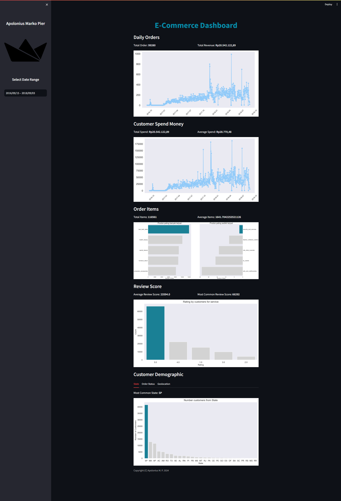

# Dicoding Collection Dashboard 

## Setup environment
```
conda create --name main-ds python=3.9
conda activate main-ds
pip install numpy pandas scipy matplotlib seaborn jupyter streamlit babel
```

## Run steamlit app
```
streamlit run project.py
```

Atau bisa dengan kunjungi website ini [Project Data Analytics](https://heroesneverdie.streamlit.app/)

</img>
